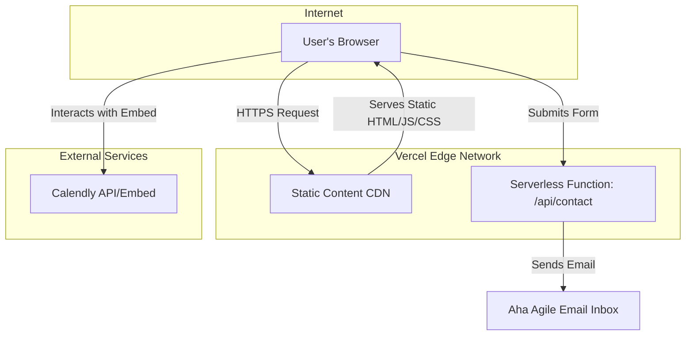

# 2. High Level Architecture

### Technical Summary

The Aha Agile website will be a modern, high-performance, serverless web application. The architecture is based on the **Jamstack** pattern, leveraging a **Next.js** frontend for static site generation and **Vercel** for deployment and serverless functions. This approach ensures a fast user experience, excellent SEO performance, robust security, and zero initial hosting costs. The system will be housed in a single **monorepo** on GitHub, providing a unified structure for both the frontend pages and the backend serverless logic required for the contact form.

### Platform and Infrastructure Choice

*   **Platform:** **Vercel**.
*   **Key Services:** Static & SSR Hosting, Serverless Functions, Global CDN (Edge Network).

### Repository Structure

*   **Structure:** **Monorepo**. A single GitHub repository will contain all the code for the project.

### High Level Architecture Diagram

### Architectural Patterns

*   **Jamstack**: Pre-rendered pages served from a CDN for performance, security, and scalability.
*   **Serverless**: All backend logic is encapsulated in on-demand, managed functions.
*   **Component-Based UI**: The frontend will be built as a collection of reusable, self-contained React components.

---

