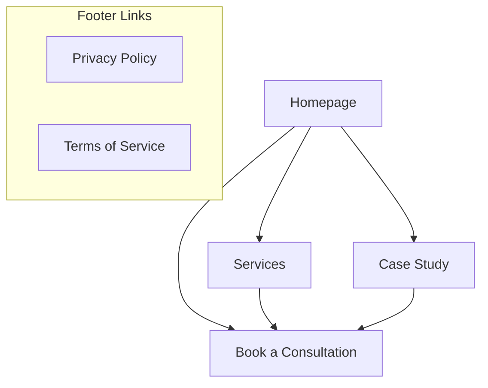
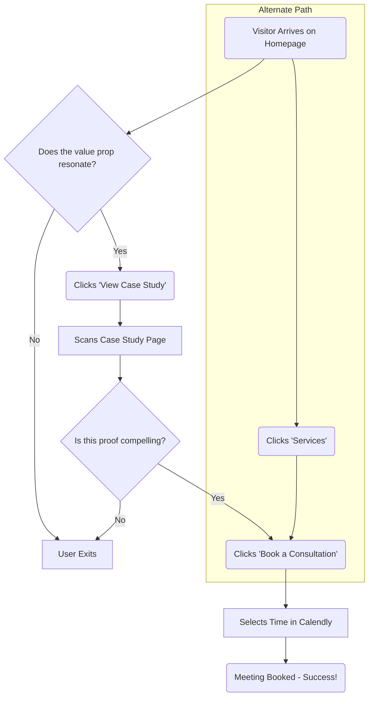

# Aha Agile Website MVP UI/UX Specification

## 1. Introduction & Overall UX Goals

This document defines the user experience goals, information architecture, user flows, and visual design specifications for the Aha Agile Website MVP. It serves as the foundation for visual design and frontend development, ensuring a cohesive and user-centered experience.

### Overall UX Goals & Principles

*   **Target User Personas**: The primary focus is the **"Hands-On Leader"**: a time-poor, pragmatic, and results-oriented business leader. The secondary persona is the **"Process Champion"**: a manager or high-performer looking for solutions to justify to their leadership.
*   **Usability Goals**:
    *   **Clarity**: A first-time visitor must understand Aha Agile's core value proposition within 10 seconds of landing on the homepage.
    *   **Efficiency**: A qualified prospect must be able to find the case study and book a consultation in fewer than 3 clicks.
    *   **Credibility**: The design must feel professional, trustworthy, and authoritative, building enough confidence for a visitor to schedule a meeting.
*   **Design Principles**:
    1.  **Clarity Over Cleverness**: Prioritize clear, direct communication. Avoid jargon, ambiguity, and overly complex animations or interactions.
    2.  **Guided Path**: Proactively guide the user along the ideal path (e.g., from problem awareness to solution evidence to conversion). Never leave the user wondering "what's next?"
    3.  **Evidence on Demand**: Make proof points (like the case study and future ROI calculators) easy to find and consume. The design should support the evidence, not distract from it.
    4.  **Respect the User's Time**: Ensure fast page load times and a frictionless, minimalist interface that allows the user to achieve their goals as quickly as possible.

---

## 2. Information Architecture (IA)

### Site Map / Screen Inventory

This diagram shows the simple, hierarchical structure of the MVP website.

### Navigation Structure

*   **Primary Navigation (Header)**: The main header navigation will be persistent on all pages and will contain three key links, ordered to match the user's journey of discovery:
    1.  **Services**: Explains *what* we do.
    2.  **Case Study**: Shows *proof* that it works.
    3.  **Book a Consultation**: The primary call-to-action to convert.
*   **Secondary Navigation (Footer)**: The footer will be minimal and will primarily serve to provide access to legal documents and reinforce credibility. It will contain links to Privacy Policy, Terms of Service, and a copyright notice.

---

## 3. User Flows

### User Flow: Lead Conversion Funnel

*   **User Goal**: To quickly understand if Aha Agile can solve my business problem and, if so, to easily schedule an initial conversation.
*   **Entry Points**: Direct visit, organic search, or a direct link to the Case Study.
*   **Success Criteria**: The user successfully books a meeting in Calendly without friction or confusion.

### Flow Diagram

*   **Edge Cases & Error Handling**:
    *   If the Calendly widget fails to load, the secondary contact form must be clearly displayed as a fallback.
    *   Form submission failures must display a clear, user-friendly error message.
    *   A simple, helpful 404 "Page Not Found" screen must be implemented.

---

## 4. Wireframes & Mockups

This section serves as a textual wireframe for the core screens.

### Key Screen Layout: Homepage
*   **Purpose**: To grab attention, validate the user's problem, and drive them to the Case Study.
*   **Elements**: Hero section with a pain-point headline and CTA to the case study; a 3-point summary of problems; a brief intro to the solution/process; a case study teaser; a final CTA to book a consultation.

### Key Screen Layout: Services Page
*   **Purpose**: To explain the "Intelligent Workflow Automation" service and build trust in the methodology.
*   **Elements**: Page Title; "What We Solve" list; "Our Process" breakdown (Discover, Design, Deploy); "What You Get" list of deliverables; a CTA to book a consultation.

### Key Screen Layout: Case Study Page
*   **Purpose**: To provide compelling, evidence-based proof of value.
*   **Elements**: A results-oriented title; an executive summary with key stats; a detailed narrative of the challenge, solution, and results (with visuals if possible); a client testimonial; a prominent CTA section.

### Key Screen Layout: Consultation & Contact Page
*   **Purpose**: To convert an interested prospect into a scheduled meeting with minimal friction.
*   **Elements**: A value-driven page title ("Book Your Free 15-Minute Process Audit"); a short paragraph reinforcing the value of the call; the embedded Calendly widget as the primary element; a fallback contact form.

---

## 5. Component Library / Design System

### Design System Approach
A simple, local component library will be created. Components will be built with **React** and styled with **Tailwind CSS**.

### Core Components
*   **Button**: Primary (solid) and Secondary (outline) variants. States: default, hover, disabled.
*   **Navigation Bar (Header)**: Desktop (horizontal) and Mobile (hamburger menu) variants.
*   **Footer**: Default variant with legal links and copyright.
*   **Card**: A flexible container for content snippets (e.g., case study teaser).
*   **Form Input**: Text and Textarea variants. States: default, focused, error, disabled.

---

## 6. Branding & Style Guide

### Color Palette
| Color Type  | Hex Code        | Usage                                   |
| :---------- | :-------------- | :-------------------------------------- |
| **Primary** | `#1E3A8A` (Dark Blue) | Primary CTAs, headlines, accents        |
| **Secondary**| `#4B5563` (Slate Gray)  | Subheadings, secondary text             |
| **Accent**  | `#F59E0B` (Amber)     | Hover effects, highlight elements       |
| **Neutral** | `#111827` (Text), `#F9FAFB` (Background), `#E5E7EB` (Borders) |

### Typography
*   **Primary (Headings)**: **"Inter"** (Google Font), sans-serif.
*   **Secondary (Body Text)**: **"Source Serif Pro"** (Google Font), serif.
*   **Type Scale**: H1 (36px), H2 (30px), H3 (24px), Body (18px).

### Iconography
*   **Icon Library**: **Heroicons** (outline style).

### Spacing & Layout
*   A consistent spacing scale based on multiples of 4px will be used for all layout spacing.

---

## 7. Accessibility Requirements

*   **Standard**: MUST meet **WCAG 2.1 Level AA** conformance.
*   **Key Requirements**: All text must meet a 4.5:1 contrast ratio; all interactive elements must have visible keyboard focus indicators; all functionality must be keyboard-operable; semantic HTML must be used for screen reader compatibility; all images must have alt text; all forms must have proper labels.

---

## 8. Responsiveness Strategy

*   **Breakpoints**: Standard Tailwind CSS breakpoints (sm, md, lg, xl) will be used.
*   **Approach**: A **mobile-first** design approach is mandatory. Styles will be for a single-column mobile layout by default, with media queries used to adapt for larger screens. The navigation will collapse to a hamburger menu on tablet and mobile sizes.

---

## 9. Animation & Micro-interactions

*   **Principles**: All motion must be purposeful, quick (200-300ms), subtle, and performant.
*   **Key Interactions**: Subtle transitions on button/link hovers; a gentle fade-in on page transitions; a border color change on form field focus; a smooth slide-in for the mobile menu.

---

## 10. Performance Considerations

*   **Goals**: The site MUST achieve excellent Core Web Vitals scores (LCP < 2.5s, INP < 100ms, CLS < 0.1).
*   **Strategies**: This will be achieved through Image Optimization (Next.js Image), Static Site Generation (SSG), minimal JavaScript, and leveraging Vercel's Global CDN.

---

## 11. Next Steps

### Immediate Actions
1.  **Finalize & Distribute Specification**: This document is the blueprint for the frontend.
2.  **Engage Architect**: Handoff this document, the PRD, and the Project Brief to the Architect agent (`*agent architect`) to create the `architecture.md`.
3.  **Optional: Generate AI UI Prompt**: Use the `*generate-ui-prompt` command to create a prompt for a tool like v0 to accelerate component creation.

### Design Handoff Checklist
*   [x] All user flows documented
*   [x] Component inventory complete
*   [x] Accessibility requirements defined
*   [x] Responsive strategy clear
*   [x] Brand guidelines (style guide) incorporated
*   [x] Performance goals established