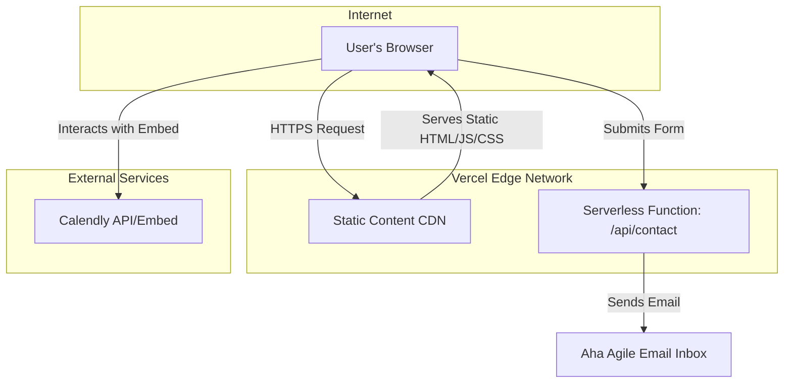

# Fullstack Architecture Document: Aha Agile Website MVP

## 1. Introduction

This document outlines the complete fullstack architecture for the Aha Agile Website MVP, including the frontend implementation, serverless functions, and their integration. It serves as the single source of truth for AI-driven development, ensuring consistency across the entire technology stack.

### Starter Template or Existing Project

N/A - This is a greenfield project that will be built from scratch using the `create-next-app` command-line tool. No existing codebase or external starter template will be used.

### Change Log

| Date       | Version | Description              | Author              |
| :--------- | :------ | :----------------------- | :------------------ |
| 27/07/2025 | 1.0     | Initial architecture draft | Winston (Architect) |

---

## 2. High Level Architecture

### Technical Summary

The Aha Agile website will be a modern, high-performance, serverless web application. The architecture is based on the **Jamstack** pattern, leveraging a **Next.js** frontend for static site generation and **Vercel** for deployment and serverless functions. This approach ensures a fast user experience, excellent SEO performance, robust security, and zero initial hosting costs. The system will be housed in a single **monorepo** on GitHub, providing a unified structure for both the frontend pages and the backend serverless logic required for the contact form.

### Platform and Infrastructure Choice

*   **Platform:** **Vercel**.
*   **Key Services:** Static & SSR Hosting, Serverless Functions, Global CDN (Edge Network).

### Repository Structure

*   **Structure:** **Monorepo**. A single GitHub repository will contain all the code for the project.

### High Level Architecture Diagram



### Architectural Patterns

*   **Jamstack**: Pre-rendered pages served from a CDN for performance, security, and scalability.
*   **Serverless**: All backend logic is encapsulated in on-demand, managed functions.
*   **Component-Based UI**: The frontend will be built as a collection of reusable, self-contained React components.

---

## 3. Tech Stack

This is the definitive technology selection for the entire project. All development MUST use these exact versions.

| Category          | Technology          | Version    | Purpose                                                  |
| :---------------- | :------------------ | :--------- | :------------------------------------------------------- |
| **Language**      | TypeScript          | `~5.4.5`   | Type safety for frontend and backend.                    |
| **Framework**     | Next.js             | `~14.2.3`  | Primary framework for UI, routing, and serverless functions. |
| **UI Library**    | React               | `~18.3.1`  | Core library for building UI components.                 |
| **Styling**       | Tailwind CSS        | `~3.4.3`   | Utility-first CSS framework for styling.                 |
| **Deployment**    | Vercel              | N/A        | Hosting, CI/CD, and serverless platform.                 |
| **Form Handling** | React Hook Form     | `~7.51.4`  | Efficient and accessible form state management.          |
| **Email API**     | Resend              | `~3.2.0`   | API for sending transactional emails from the serverless function. |
| **Testing**       | Jest / RTL          | `~29.7.0`  | Unit and integration testing framework.                  |
| **E2E Testing**   | Playwright          | `~1.44.0`  | End-to-end testing framework.                            |
| **Linting**       | ESLint              | `~8.57.0`  | Code linting and style enforcement.                      |

---

## 4. API Specification

### Contact Form API Endpoint

A single API endpoint will be created to handle submissions from the fallback contact form.

*   **Endpoint**: `POST /api/contact`
*   **Description**: Receives contact form data, validates it, and sends an email notification.
*   **Request Body (JSON)**:
    ```json
    {
      "name": "string",
      "email": "string (email format)",
      "message": "string"
    }
    ```
*   **Success Response (`200 OK`)**:
    ```json
    {
      "status": "success",
      "message": "Your message has been sent successfully."
    }
    ```
*   **Error Response (`400 Bad Request`, `500 Internal Server Error`)**:
    ```json
    {
      "status": "error",
      "message": "A specific error message."
    }
    ```
*   **Implementation**: This will be a Vercel Serverless Function located at `/pages/api/contact.ts`.

---

## 5. Unified Project Structure

The project will follow the standard Next.js `app` router directory structure.

```plaintext
/
├── .github/                # CI/CD workflows
│   └── workflows/
│       └── ci.yaml
├── .vscode/                # VSCode settings
├── content/                # Markdown content files
│   ├── case-study.md
│   ├── homepage.md
│   └── services.md
├── public/                 # Static assets (images, fonts)
├── src/
│   ├── app/                # Next.js App Router
│   │   ├── (legal)/        # Route group for legal pages
│   │   │   ├── privacy-policy/
│   │   │   │   └── page.mdx
│   │   │   └── terms-of-service/
│   │   │       └── page.mdx
│   │   ├── api/            # API routes
│   │   │   └── contact/
│   │   │       └── route.ts
│   │   ├── case-study/     # Case study page
│   │   │   └── page.tsx
│   │   ├── services/       # Services page
│   │   │   └── page.tsx
│   │   ├── book-a-consultation/ # Consultation page
│   │   │   └── page.tsx
│   │   ├── layout.tsx      # Root layout
│   │   └── page.tsx        # Homepage
│   ├── components/           # Reusable React components
│   │   ├── ui/             # Core UI elements (Button, Card)
│   │   └── layout/         # Layout components (Header, Footer)
│   ├── lib/                  # Libraries and utilities
│   │   └── markdown.ts     # Markdown rendering utility
│   └── styles/               # Global styles
│       └── globals.css
├── tests/                  # Test files
│   └── e2e/                # Playwright E2E tests
├── .eslintrc.json
├── .gitignore
├── jest.config.js
├── next.config.mjs
├── package.json
├── postcss.config.js
├── README.md
├── tailwind.config.ts
└── tsconfig.json
```

---

## 6. Development Workflow

### Local Development Setup

1.  Clone the GitHub repository.
2.  Install dependencies: `npm install`
3.  Create a `.env.local` file for environment variables.
4.  Run the development server: `npm run dev`

### Environment Configuration (`.env.local`)

```bash
# Used by the /api/contact serverless function
RESEND_API_KEY=your_resend_api_key
CONTACT_FORM_EMAIL_TO=your_email@example.com
```

---

## 7. Security and Performance

### Security Requirements

*   **Contact Form**: The `/api/contact` endpoint must perform server-side validation on all incoming data. Environment variables (API keys) must be used and never exposed on the client side.
*   **Dependencies**: The project must use a tool like `npm audit` to check for security vulnerabilities in dependencies.
*   **HTTPS**: Vercel enforces HTTPS automatically.

### Performance Optimization

*   **Static Site Generation (SSG)**: All content pages (Homepage, Services, Case Study) will be statically generated at build time for maximum performance.
*   **Image Optimization**: All images will be optimized using the `<Image>` component from `next/image`.
*   **Minimal JavaScript**: The architecture avoids heavy client-side JavaScript, leading to fast load times.

---

## 8. Testing Strategy

*   **Unit Tests**: Key UI components (e.g., Header, Button) and utility functions will be unit-tested using **Jest** and **React Testing Library**. Tests will be located alongside the component files (e.g., `Button.test.tsx`).
*   **Integration Tests**: The `/api/contact` serverless function will be tested to ensure it correctly handles valid and invalid requests.
*   **E2E Tests**: The primary user funnel (Homepage -> Case Study -> Consultation Page) will be tested using **Playwright** to ensure the core business goal is always functional.

---

## 9. Coding Standards

*   **Type Sharing**: Not applicable for this simple architecture, but as the project grows, shared types should be defined in a `src/types` directory.
*   **API Calls**: All client-side API calls to our own backend (e.g., the contact form) will be made using the native `fetch` API.
*   **Environment Variables**: Server-side environment variables must only be accessed in server components or API routes, never exposed to the client.

---

## 10. Checklist Results Report

*   This architecture document will be validated against the `architect-checklist.md` before development begins to ensure completeness and quality.